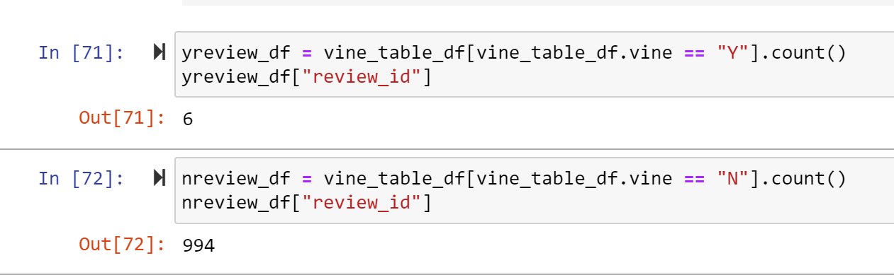
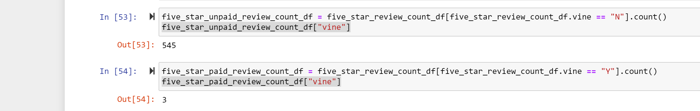
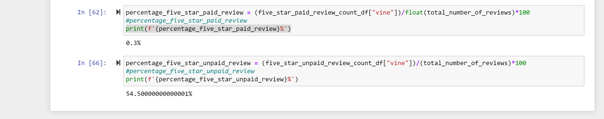

# Amazon_Vine_Analysis

## Overview of the analysis

I used the wireless products reviews data set, from clothing apparel to wireless products. Using PySpark, I performed the ETL process to extract the dataset, transform the data, connect to an AWS RDS instance, and load the transformed data into pgAdmin. Next, I used Pandas to determine if there is any bias toward favorable reviews from Vine members in my dataset.

## Results: Using bulleted lists and images of DataFrames as support, address the following questions:

### How many Vine reviews and non-Vine reviews were there?

There were 6 vine reviews out of my selected 1000 samples

There were 994 non-Vine reviews out of my selected 1000 samples

### How many Vine reviews were 5 stars? How many non-Vine reviews were 5 stars?

There were 3 Vine 5 stars reviews from my selected samples

There were 545 non-Vine 5 stars reviews from my selected samples

### What percentage of Vine reviews were 5 stars? What percentage of non-Vine reviews were 5 stars?

There were 0.3%  of Vine reviews were 5 stars

There were 54.5% of Vine reviews were 5 stars

## Summary: 

Summarily, there is a positivity bias for reviews in the Vine program as seen in the images above. 

An additional analysis that can be performed is to confirm the relationship between the reviews and the verified purchase. 
